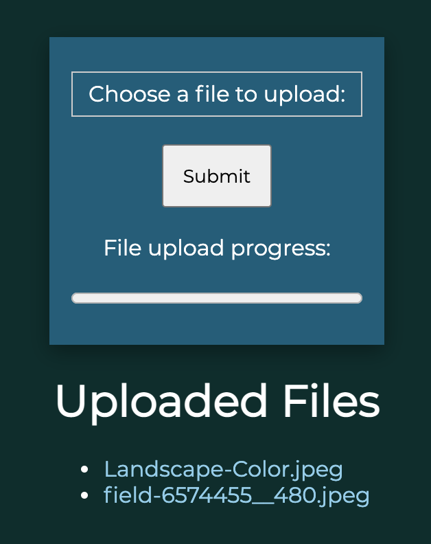

# File Upload Service

A simple server written using NodeJS and Express to upload and download files.  
Mainly used for sharing files between computers on the same WiFi.



## Prerequisites

- NodeJS

## Usage

```
npm install
npm run start
```
and then go to http://localhost:8080
